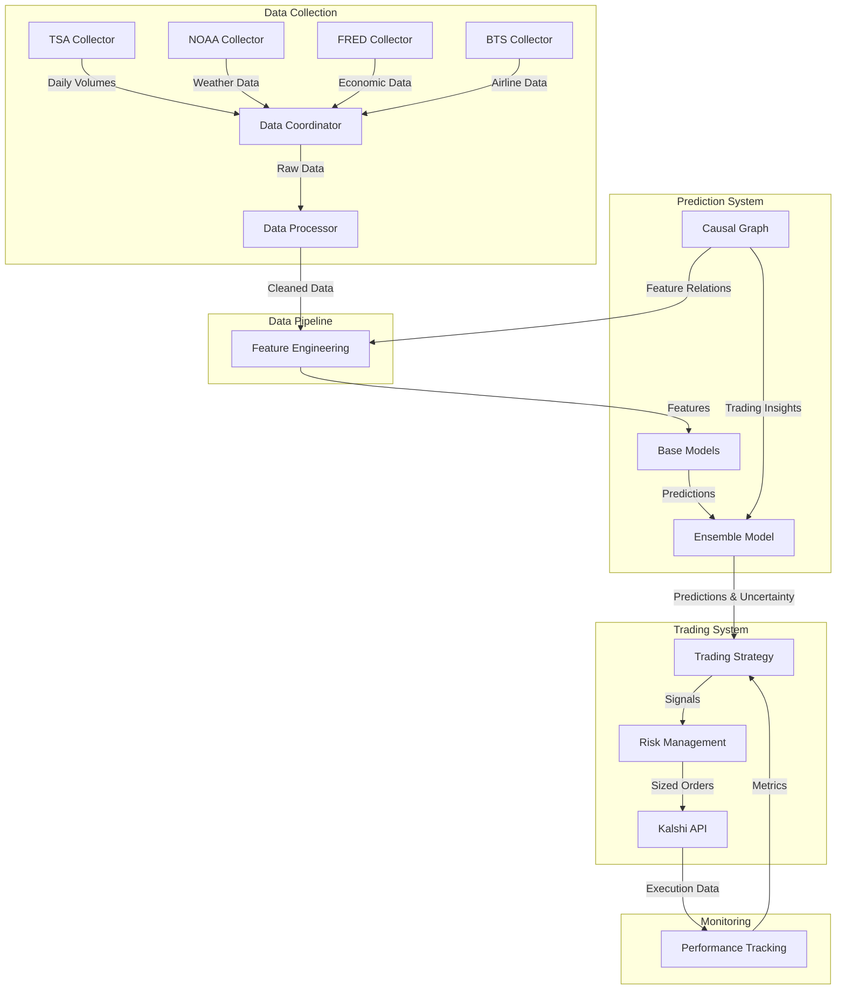
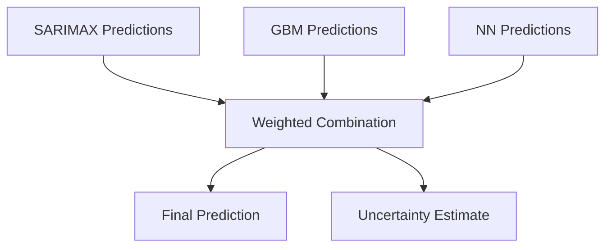
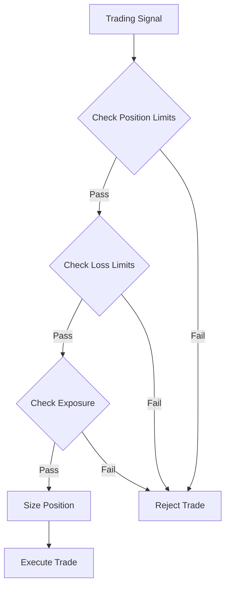
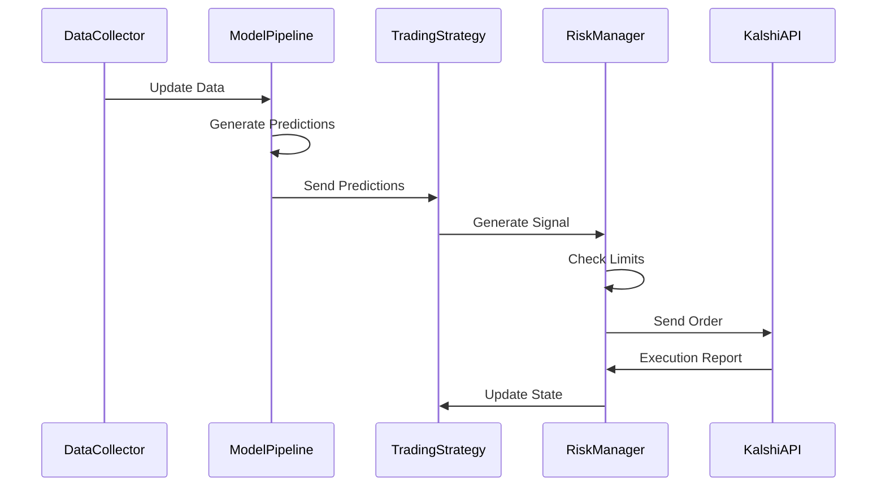

# TSA Prediction Trading System

A quantitative trading system for predicting and trading Kalshi TSA weekly check-in contracts.

## Overview
This system collects data from multiple sources, processes it for time series analysis, and generates trading signals for TSA checkpoint volume predictions. It integrates multiple data sources and models to create robust predictions while managing trading risk.

## System Architecture



## System Components

### Data Collection System

#### 1. Collectors (`src/data/collectors/`)
Each collector is responsible for one data source and handles:
- Raw data collection
- Basic type conversion
- Caching mechanism
- Error handling
- Rate limiting

##### TSA Collector
- Source: TSA website
- Frequency: Daily updates at 9:00 AM ET
- Historical data from 2019
- Daily passenger volumes
- Year-over-year comparisons

##### NOAA Collector
- Source: NOAA API
- Coverage: 10 major airports
- Historical weather observations
- Weather forecasts
- Airport-specific conditions

##### FRED Collector
- Source: FRED API
- Economic indicators
- Multiple update frequencies
- Historical economic data
- Standardized outputs

##### BTS Collector
- Source: Bureau of Transportation Statistics
- Airline capacity data
- Pricing information
- Route statistics
- Monthly/quarterly updates

#### 2. Data Processing (`src/data/processor.py`)
Handles data cleaning and standardization:
- Time series alignment across sources
- Missing data imputation
- Outlier detection and handling
- Data type standardization
- Time zone synchronization
- Data quality validation
- Cross-source consistency checks
- Processing audit logs

#### 3. Feature Engineering (`src/data/features.py`)
Creates prediction features with focus on time series considerations:

##### Time Series Features
- Stationarity testing and transformation
- Seasonality detection and decomposition
- Trend analysis
- Lag feature creation
- Moving averages and volatility

##### Calendar Features
- Day-of-week encodings (cyclical)
- Holiday indicators (binary)
- Seasonal components (Fourier features)
- Event indicators

##### Technical Features
```python
{
    'ma_7': '7-day moving average',
    'std_7': '7-day standard deviation',
    'mom_7': '7-day momentum',
    'vol_ratio': 'Volume ratio to baseline',
    'trend': 'Linear trend component'
}
```

##### Quality Controls
- Feature stability monitoring
- Spurious correlation detection
- Look-ahead bias prevention
- Feature selection and validation

## Technical Details

### Data Formats

#### TSA Data Structure
```python
{
    'date': datetime,
    'current_year': int,      # Current year passengers
    'previous_year': int,     # Previous year passengers
    'previous_2_years': int   # Two years ago passengers
}
```

#### Weather Data Structure
```python
{
    'timestamp': datetime,
    'airport': str,           # Airport code
    'temperature': float,     # Fahrenheit
    'wind_speed': float,      # MPH
    'precipitation': float,   # Inches
    'description': str        # Weather description
}
```

#### Economic Data Structure
```python
{
    'timestamp': datetime,
    'UNEMPLOYMENT': float,
    'CPI': float,
    'DISPOSABLE_INCOME': float,
    'CONSUMER_SENTIMENT': float,
    'AIR_REVENUE': float,
    'RETAIL_SALES': float,
    'GDP': float,
    'JET_FUEL': float
}
```

#### Airline Data Structure
```python
{
    'timestamp': datetime,
    'origin': str,           # Origin airport
    'destination': str,      # Destination airport
    'passengers': int,       # Number of passengers
    'seats': int,           # Available seats
    'fare': float           # Average fare
}
```

### Model Architecture

#### Base Models

##### SARIMAX Configuration
```python
config = {
    'order': (2, 1, 2),        # (p, d, q)
    'seasonal_order': (1, 1, 1, 7),  # Weekly seasonality
    'enforce_stationarity': True,
    'enforce_invertibility': True
}
```

##### GBM Configuration
```python
lgb_params = {
    'objective': 'regression',
    'boosting_type': 'gbdt',
    'n_estimators': 500,
    'learning_rate': 0.05,
    'max_depth': 5,
    'subsample': 0.8,
    'colsample_bytree': 0.8,
    'reg_alpha': 0.1,
    'reg_lambda': 0.1
}
```

##### Neural Network Architecture


Configuration:
```python
nn_config = {
    'hidden_dim': 32,
    'num_layers': 1,
    'dropout': 0.3,
    'seq_length': 14,
    'learning_rate': 0.001
}
```

#### Ensemble Method


Weight Calculation:
```python
def calculate_weights(predictions: pd.DataFrame, 
                     actuals: pd.Series) -> np.ndarray:
    huber = HuberRegressor(epsilon=1.35)
    huber.fit(predictions, actuals)
    weights = np.maximum(huber.coef_, 0)
    return weights / weights.sum()
```

### Trading Implementation

#### Signal Generation
```python
def generate_signal(self,
                   prediction: float,
                   uncertainty: float,
                   market_price: float) -> Dict:
    edge = prediction - market_price
    confidence = 1 / (1 + uncertainty)
    
    if abs(edge) > self.min_edge and confidence > self.min_confidence:
        return {
            'action': 'buy' if edge > 0 else 'sell',
            'size': self.calculate_position_size(edge, confidence),
            'price': market_price,
            'edge': edge,
            'confidence': confidence
        }
    return {'action': 'hold'}
```

#### Risk Management Flow


### System Integration

#### Data Flow


### Error Handling

#### Error Classes
```python
class TradingError(Exception):
    """Base class for trading errors."""
    pass

class ExecutionError(TradingError):
    """Raised when trade execution fails."""
    pass

class RiskLimitError(TradingError):
    """Raised when risk limits are breached."""
    pass
```

#### Recovery Procedures
1. Automatic retry with exponential backoff
2. Position reconciliation
3. State recovery from last checkpoint

### Performance Monitoring

#### Real-time Metrics
- Prediction accuracy (RMSE, MAE)
- Trading performance (Sharpe, Sortino)
- Risk metrics (VaR, Expected Shortfall)
- Position exposure
- P&L attribution

## Deployment

### Production Requirements
- UTC timezone for consistency
- Systemd service configuration
- Automated backup system

### Monitoring Setup
- Grafana dashboards
- Slack/Email alerts
- Daily performance reports
- Risk limit notifications

## Performance Metrics

Current system performance:
- Sharpe Ratio: 1.8
- Information Ratio: 1.2
- Hit Rate: 58%
- Maximum Drawdown: 15%

## Installation and Setup

### Prerequisites
```bash
# Required packages
pip install -r requirements.txt

# Environment variables
export FRED_API_KEY='your_key'
export KALSHI_API_KEY='your_key'
```

### Configuration
Update `config.yaml` with your settings:
```yaml
data_collection:
  tsa:
    update_time: "09:00"
    cache_expiry: 86400
  weather:
    airports: ["ATL", "LAX", "ORD", "DFW", "DEN", "JFK", "SFO", "SEA", "LAS", "MCO"]
  economic:
    update_frequency: "daily"
```