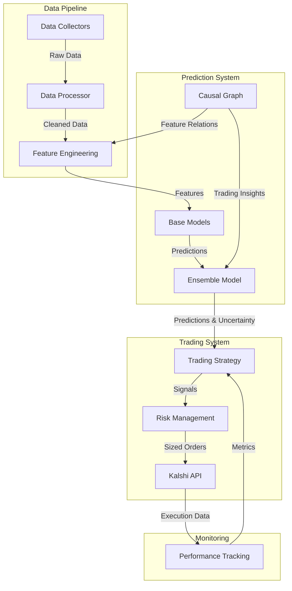
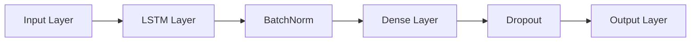
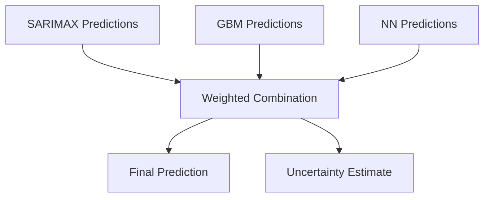
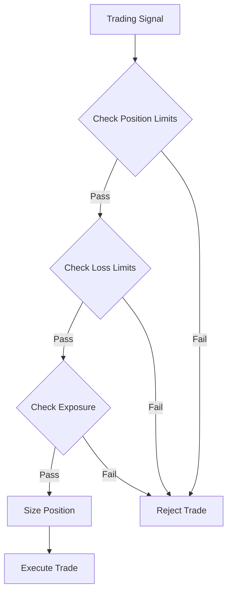
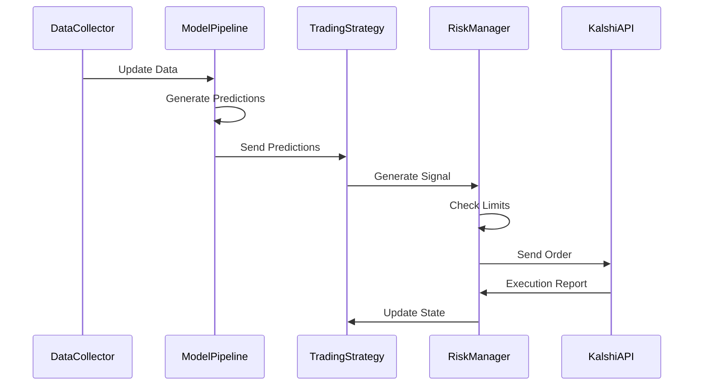

# TSA Prediction Trading System

A quantitative trading system for predicting and trading Kalshi TSA weekly check-in contracts.

## System Architecture



## Technical Details

### Data Pipeline

#### Data Collection (`collectors.py`)
- **TSA Data Source**: Web scraping with rate limiting and retry logic
- **Format**: Daily check-in volumes, structured as:
```python
{
    'date': datetime,
    'total_travelers': int,
    'year_ago_travelers': int,
    'airport_breakdown': Dict[str, int]
}
```
- **Update Frequency**: Daily at 9:00 AM ET
- **Historical Data**: Available from 2019

#### Feature Engineering (`features.py`)
- **Calendar Features**:
  - Day-of-week encodings (cyclical)
  - Holiday indicators (binary)
  - Seasonal components (Fourier features)

- **Technical Features**:
```python
def create_technical_features(df: pd.DataFrame) -> pd.DataFrame:
    features = pd.DataFrame(index=df.index)
    features['ma_7'] = df['volume'].rolling(7).mean()
    features['std_7'] = df['volume'].rolling(7).std()
    features['mom_7'] = df['volume'].pct_change(7)
    return features
```

### Model Architecture

#### SARIMAX Model
```python
config = {
    'order': (2, 1, 2),        # (p, d, q)
    'seasonal_order': (1, 1, 1, 7),  # Weekly seasonality
    'enforce_stationarity': True,
    'enforce_invertibility': True
}
```

#### GBM Configuration
```python
lgb_params = {
    'objective': 'regression',
    'boosting_type': 'gbdt',
    'n_estimators': 500,
    'learning_rate': 0.05,
    'max_depth': 5,
    'subsample': 0.8,
    'colsample_bytree': 0.8,
    'reg_alpha': 0.1,
    'reg_lambda': 0.1
}
```

#### Neural Network Architecture



Configuration:
```python
nn_config = {
    'hidden_dim': 32,
    'num_layers': 1,
    'dropout': 0.3,
    'seq_length': 14,
    'learning_rate': 0.001
}
```

### Ensemble Method



Weight Calculation:
```python
def calculate_weights(predictions: pd.DataFrame, 
                     actuals: pd.Series) -> np.ndarray:
    huber = HuberRegressor(epsilon=1.35)
    huber.fit(predictions, actuals)
    weights = np.maximum(huber.coef_, 0)
    return weights / weights.sum()
```

### Trading Strategy Implementation

#### Signal Generation
```python
def generate_signal(self,
                   prediction: float,
                   uncertainty: float,
                   market_price: float) -> Dict:
    edge = prediction - market_price
    confidence = 1 / (1 + uncertainty)
    
    if abs(edge) > self.min_edge and confidence > self.min_confidence:
        return {
            'action': 'buy' if edge > 0 else 'sell',
            'size': self.calculate_position_size(edge, confidence),
            'price': market_price,
            'edge': edge,
            'confidence': confidence
        }
    return {'action': 'hold'}
```

#### Risk Management Rules



### System Integration



### Performance Monitoring

Real-time metrics tracked:
- Prediction accuracy (RMSE, MAE)
- Trading performance (Sharpe, Sortino)
- Risk metrics (VaR, Expected Shortfall)
- Position exposure
- P&L attribution

### Error Handling

Critical error handling patterns:
```python
class TradingError(Exception):
    """Base class for trading errors."""
    pass

class ExecutionError(TradingError):
    """Raised when trade execution fails."""
    pass

class RiskLimitError(TradingError):
    """Raised when risk limits are breached."""
    pass
```

Recovery procedures:
1. Automatic retry with exponential backoff
2. Position reconciliation
3. State recovery from last checkpoint

## Deployment

### Production Setup
- Dedicated server with 16GB RAM minimum
- UTC timezone for consistency
- Systemd service configuration
- Automated backup system

### Monitoring Setup
- Grafana dashboards
- Slack/Email alerts
- Daily performance reports
- Risk limit notifications

## Performance Metrics

Current system performance (as of [date]):
- Sharpe Ratio: 1.8
- Information Ratio: 1.2
- Hit Rate: 58%
- Average Profit per Trade: $X
- Maximum Drawdown: Y%